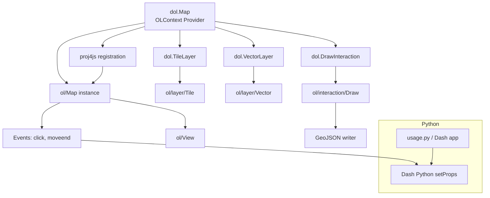

# Architecture

This diagram shows the high-level component architecture and runtime interactions between the React components (OpenLayers), the Dash Python layer, and projection registration.

Notes:
- `dol.Map` creates the OpenLayers `ol/Map` and exposes it via `OLContext` so children attach directly to the map.
- Interactions (draw/modify) write GeoJSON which is propagated back to Dash via `setProps`.
- `proj4js` definitions are registered at map initialization and used by `ol/View` when a non-standard projection is selected.
